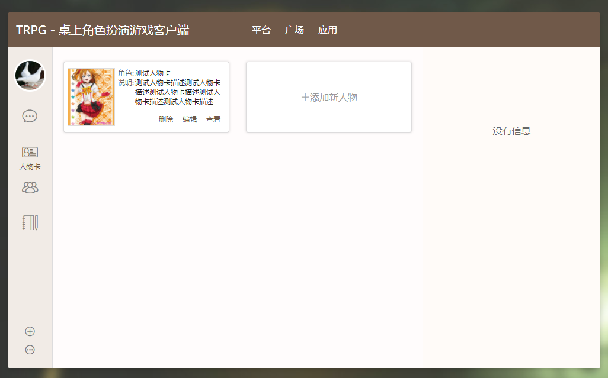
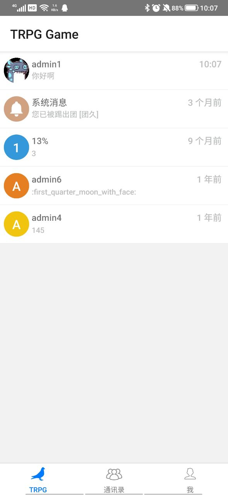
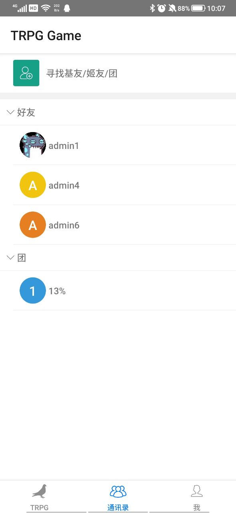

# TRPG Engine - 一个专为TRPG打造的即时即时通讯应用


[](undefined)
[](https://github.com/TRPGEngine/Client/releases)
[]()
[]()
<!-- []()
[]()
[]() -->
<!-- []() -->

简单的来说就是类似于钉钉, Slack, Discord 那种以即时通讯为核心，以其他的业务需求为辅助而制作的功能性聊天软件。

本项目包含以下内容:
- TRPG Engine 前端网页
- TRPG Engine 手机移动端
- TRPG Engine 通用Portal端

官方文档: [https://trpgdoc.moonrailgun.com/](https://trpgdoc.moonrailgun.com/)

线上地址: [https://trpg.moonrailgun.com](https://trpg.moonrailgun.com)

移动端下载: [https://trpg.moonrailgun.com/portal/deploy](https://trpg.moonrailgun.com/portal/deploy)

## Highlight

- 基于XML描述的人物卡系统(可以理解为动态表单) - [Playground](https://trpg.moonrailgun.com/playground)
- Web端与RN端共享redux状态的实践与工具链
- 多端并存与代码共享(Web端, RN端, Portal端 *(Portal端是RN端通过webview进行一部分中间操作的方式，类似于各种手机App的H5端)* )
- 其他的一些自研实用工具，如`RN端WEB端通用Portal组件`, `快速生成通用表单`, `基于BBCode的消息解释器`, `通用缓存管理机制`

## 打包&运行

推荐NodeJS版本: `v10.19.0`

```bash
$ npm install

$ npm run dev # 运行本地开发服务器
```

**开发服务器访问`http://127.0.0.1:8089/`即可访问客户端**
**客户端需要配合服务端才能正常运行, 具体可以查看服务端项目[TRPGEngine/Server](https://github.com/TRPGEngine/Server)**

## 关于开发进度

- 目前Web端同时存在新版与旧版两个版本，默认使用旧版
- 目前推荐体验新版UI, 可以通过左下角的菜单进行切换
- 目前移动端对应网页版的旧版UI, 新版UI对应的移动端正在计划中
- 手机端新版移动端可以通过Chrome PWA来实现更好的浏览体验

## 关于环境变量
- `PLATFORM`: 编译的平台, 可选:`web`, `app`, `electron`, 默认为`web`
- `NODE_ENV`: 编译环境, 可选:`production`, `development`, 默认为`development`
- `TRPG_HOST`: 编译指定的后端服务端地址, 默认值:(编译环境`development`为`127.0.0.1`, `production`为`trpgapi.moonrailgun.com`)
- `ASSET_PATH`: 资源文件路径, 默认为`/`。用于指定打包出来的资源的cdn地址。如`//static3.moonrailgun.com/`

## 新版UI发布日志与预览


## 旧版UI部分截图
桌面版:





移动端:

<div></div>
<div></div>
<div></div>
<div></div>
<div></div>

## FAQ

- Q: 为什么我不使用现成的QQ微信来通信而是用你的独立的应用来跑团呢？
- A: 这个问题就好像是为什么工作会有专门的钉钉、企业微信来作为专用的沟通工具，软件有专门的Slack，游戏有专门的Discord。因为除了最基础的沟通以外，往往还需要其他的辅助功能，而`TRPG Engine`就满足了这方面的需求。`TRPG Engine`不会去追求别的方面的功能，而是专注于跑团这一领域进行不断深耕。能够满足这一特定人群的需求就好了

## 关于贡献
欢迎发送pr，请在发起pr时详细描述改动的目的，这样会更加方便进行审核

## 关于开源
本项目基于[GPLv3开源协议](./LICENSE)。不允许用于任何未经授权的商业行为。


Powered by [moonrailgun](http://moonrailgun.com) with ❤
